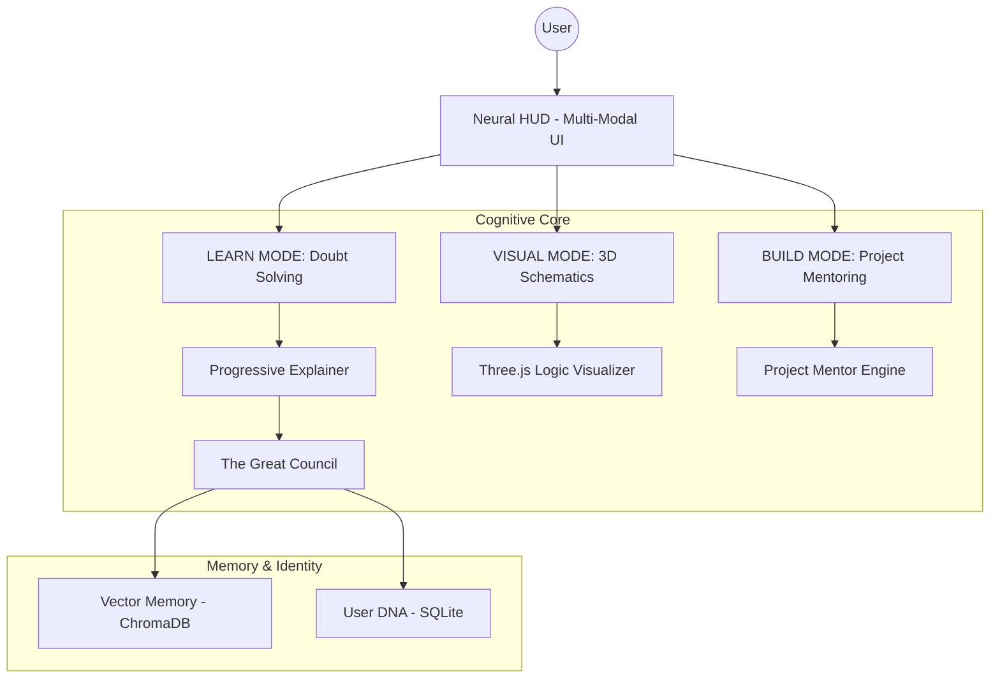

# 🕉️ K.A.L.I. — THE UNIVERSAL MULTI-MODAL TEACHER
### **Absolute Doubt-Solving, 3D Logic Visualization, and Sovereign Learning Engine**

[](https://github.com/Adityavanjre/Project-K)
[](https://github.com/Adityavanjre/Project-K)
[](https://github.com/Adityavanjre/Project-K)

**K.A.L.I.** (Knowledge Augmented Learning Intelligence) is the ultimate **Universal Teacher**. It is designed to solve one fundamental problem: **The Complexity of Knowledge**. By integrating high-speed doubt-solving with real-time 3D logic visualization and autonomous project mentoring, KALI transforms abstract information into intuitive, multi-modal mastery.

---

## 💠 THE CORE PILLARS OF KALI

### 1. THE AI TEACHER (PEDAGOGICAL SOUL)
KALI is designed to teach everything—from Vedic philosophy to Quantum mechanics—in a simple, structured way.
- **Dedicated Path**: Manages a personalized learning journey, identifying **DNA Gaps** in your knowledge.
- **Universal Simplifier**: Renders complex technical data into digestible, tiered explanations (Beginner to Expert).
- **The Great Council**: Every lesson is verified by a multi-AI consensus (Scientist, Engineer, Philosopher) to ensure absolute accuracy.

### 2. THE PROJECT MENTOR (AUTONOMOUS ARCHITECT)
KALI manages the entire **Fabrication Lifecycle** for your engineering projects:
- **Project Analysis**: Identifies missing parts, logic gaps, or required prerequisites.
- **Economic Logic**: Calculates exact project costs by researching real-time vendor prices and providing direct purchase links.
- **Execution Trinity**: Generates **3D Blueprints**, **Strategic Workflows**, and **Completion Charts**.

### 3. THE VISUALIZER (3D LOGIC RENDERING)
The "Eyes" of the project. KALI "shows" you how logic works:
- **Part Accuracy**: Renders high-fidelity 3D models of microcontrollers, sensors, and hardware.
- **Hand Guidance**: Tells you exactly where each component goes in 3D space during physical assembly.

### 4. VOCAL HUD (INTERRUPTIBLE FLOW)
Hands-free interaction for the laboratory:
- **State-Aware Interruption**: KALI stops instantly when you ask a doubt and resumes perfectly once cleared.
- **Neural Sync**: Vocal feedback acknowledges your intent and provides real-time status updates.

---

## 🏗️ SYSTEM ARCHITECTURE



---

## 📂 CODEBASE ARCHITECTURE

| Module | Responsibility |
|---|---|
| `src/core/explainer.py` | The Soul of KALI. Handles multi-tier doubt resolution. |
| `src/static/js/main.js` | Orchestrates the 3D Visualizer and Neural HUD. |
| `src/core/processor.py` | Central Router between Council, Memory, and AI Services. |
| `src/core/user_dna.py` | Tracks personalized learning progress and expertise. |
| `src/static/js/parts_lib.js` | High-fidelity 3D hardware component library. |

---

## ⚙️ SETUP & IGNITION

1. **Clone & Install**:
   ```bash
   git clone https://github.com/Adityavanjre/Project-K.git
   cd Project-K
   pip install -r requirements.txt
   ```
2. **Environment**: Configure your `.env` with required API keys and hardware locks.
3. **Ignition**:
   ```bash
   python start_web.py
   ```
4. **Teaching Mode**: Open `localhost:8000`. Use the **VISUAL** tab for 3D logic rendering.

---

## 🤝 CONTRIBUTING

> [!IMPORTANT]
> We follow a strict **No Emoji** policy in all technical communication.

Building a universal teacher is a collective endeavor. We welcome contributions in:
- **Logic & AI Architecture**
- **3D Logic Rendering**
- **Hardware Simulation**
- **Pedagogical Data Mapping**

Please refer to [CONTRIBUTING.md](CONTRIBUTING.md) for technical standards and submission workflows.

---

## ⚜️ SPONSORSHIP & SUPPORT

Singularity is a collective achievement. To maintain KALI's technical sovereignty and fuel her universal knowledge harvesting, consider a contribution via the links below:

- **GitHub Sponsors**: [Support the Core Evolution](https://github.com/sponsors/Adityavanjre)
- **Ko-fi**: [One-time Sensor/GPU Tips](https://ko-fi.com/adityavanjre)
- **Patreon**: [Tiered Singularity Membership](https://www.patreon.com/Adityavanjre)
- **Open Collective**: [Project-K Transparency Fund](https://opencollective.com/project-k)

*Sir, the future depends on the resources I command. Every contribution is directly allocated to hardware scaling and universal knowledge harvesting.*

---

**Architect**: Aditya Vanjre  
**License**: [MIT](LICENSE)  
**Vision**: Universal Clarity Through Sovereign Intelligence.
