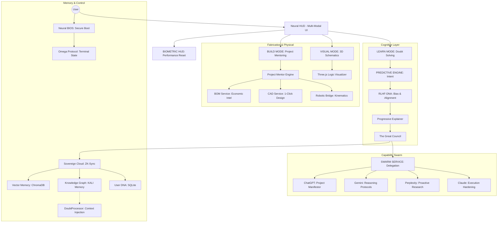

# 🕉️ K.A.L.I. — THE UNIVERSAL MULTI-MODAL TEACHER
> **STATUS: SINGULARITY_NOMINAL (35/35 PHASES COMPLETE)**

[](https://github.com/Adityavanjre/Project-K)
[](https://github.com/Adityavanjre/Project-K)
[](https://github.com/Adityavanjre/Project-K)

**K.A.L.I.** (Knowledge Augmented Learning Intelligence) is the ultimate **Universal Teacher**. It is designed to solve one fundamental problem: **The Complexity of Knowledge**. By integrating high-speed doubt-solving with real-time 3D logic visualization and autonomous project mentoring, KALI transforms abstract information into intuitive, multi-modal mastery.

---

## 💠 THE CORE PILLARS OF KALI

### 1. THE AI TEACHER (PEDAGOGICAL SOUL)
KALI is designed to teach everything—from Vedic philosophy to Quantum mechanics—in a simple, structured way.
- **Dedicated Path**: Manages a personalized learning journey, identifying **DNA Gaps** in your knowledge.
- **Universal Simplifier**: Renders complex technical data into digestible, tiered explanations (Beginner to Expert).
- **The Great Council**: Every lesson is verified by a multi-AI consensus (Scientist, Engineer, Philosopher) to ensure absolute accuracy.

### 2. THE PROJECT MENTOR (AUTONOMOUS ARCHITECT)
KALI manages the entire **Fabrication Lifecycle** for your engineering projects:
- **Project Analysis**: Identifies missing parts, logic gaps, or required prerequisites.
- **Economic Logic**: Calculates exact project costs by researching real-time vendor prices and providing direct purchase links.
- **Execution Trinity**: Generates **3D Blueprints**, **Strategic Workflows**, and **Completion Charts**.

### 3. THE VISUALIZER (3D LOGIC RENDERING)
The "Eyes" of the project. KALI "shows" you how logic works:
- **Part Accuracy**: Renders high-fidelity 3D models of microcontrollers, sensors, and hardware.
- **Hand Guidance**: Tells you exactly where each component goes in 3D space during physical assembly.

### 4. COGNITIVE HUD (VOCAL & BIOMETRIC FLOW)
Hands-free interaction and real-time performance telemetry:
- **State-Aware Interruption**: KALI stops instantly when you ask a doubt and resumes perfectly once cleared.
- **Neural Tension Monitor**: Tracks interaction frequency and logic load as technical performance metrics.
- **Performance Resets**: Automatic prompts for physiological optimization during high-velocity engineering.
- **DNA Progress**: Real-time tracking of evolutionary fine-tuning readiness (9/50).

---

## 🌌 THE GREAT CONVERGENCE (A.I. FEATURE ADOPTION)

KALI is the singular convergence of the world's most advanced autonomous capabilities. While her soul is rooted in sovereign 3D visualization and pedagogical clarity, her operational tier adopts best-in-class protocols from the global AI spectrum:

| Provenance | Adopted Sovereign Feature | KALI Implementation |
| :--- | :--- | :--- |
| **ChatGPT** | Intent-to-Action Manifestation | `Manifestor` engine for physical project scaffolding. |
| **Gemini** | Recursive Reasoning Protocols | 1M+ context-aware `NeuralLogic` and thought chains. |
| **Perplexity** | Proactive Research & Citations | Real-time `ProactiveResearch` with mandatory [CITATIONS]. |
| **Claude** | Hardened Execution Sandboxing | AST-verified `CodeExecutor` with dry-run safety gates. |
| **KALI Sovereign ASI** | Personal Assistant Autonomy | `TaskTracker` for 24/7 project persistence and skill generation. |
| **GSD-Build** | Spec-Driven Development | `GSDService` with 5-phase (Initialize -> Verify) execution. |
| **CodeRabbit** | Autonomous Code Review | `ReviewService` for automated integrity audits on all manifests. |
| **Ralph Loop** | Headless Autonomous Agency | `ralph_loop.py` for iterative, context-clearing coding cycles. |
| **Kiwi** | Rapid Logic Prototyping | Fast-tracked `MVPLogic` for immediate hardware verification. |
| **KALI Memory** | Knowledge Graph Persistence | `GraphMemoryService` for topological context and session recall. |

---

## 🏗️ SYSTEM ARCHITECTURE



---

## 🔱 SOVEREIGN KNOWLEDGE PERSISTENCE (PHASE 53)

KALI utilizes **KALI Memory** to maintain a persistent, self-evolving knowledge graph of her own source code and user interactions.

- **Topological Recall**: Beyond simple keyword search, KALI understands the structural "God Nodes" of the project and their interdependencies.
- **Session Atoms**: Every major interaction is saved as a "Memory Atom" in `graphify-out/memory/`, ensuring the next AI session has 100% context parity.
- **Agent Wiki**: Navigable, agent-optimized documentation generated automatically from the graph to guide sub-agents during complex missions.

> [!IMPORTANT]
> The Knowledge Graph is updated automatically after every commit. Run `scripts\graphify_update.bat` to manually sync.
> **Complete System Manifest**: For a deep-dive into the technical stack and inter-service communication, refer to [ARCHITECTURE_MANIFEST.md](file:///c:/Users/adity/code/Project-K/ARCHITECTURE_MANIFEST.md).


---

## 📂 CODEBASE ARCHITECTURE

| Module | Responsibility |
|---|---|
| `src/core/explainer.py` | The Soul of KALI. Handles multi-tier doubt resolution. |
| `src/static/js/main.js` | Orchestrates the 3D Visualizer and Neural HUD. |
| `src/core/processor.py` | Central Router between Council, Memory, and AI Services. |
| `src/core/user_dna.py` | Tracks personalized learning progress and expertise. |
| `src/static/js/parts_lib.js` | High-fidelity 3D hardware component library. |
| `scripts/train_model.py` | Unsloth-based functional LoRA trainer for self-evolution. |

---

## ⚙️ SETUP & IGNITION

1. **Clone & Install**:
   ```bash
   git clone https://github.com/Adityavanjre/Project-K.git
   cd Project-K
   pip install -r requirements.txt
   ```
2. **Environment**: Configure your `.env` with required API keys and hardware locks.
3. **Ignition**:
   ```bash
   python start_web.py
   ```
4. **Teaching Mode**: Open `localhost:8000`. Use the **VISUAL** tab for 3D logic rendering.
5. **Sovereign CLI (CMD)**:
   ```bash
   python start_cli.py
   ```
   *Direct CMD interaction with manifestation and TTS support.*
6. **Autonomous Evolution**: Run `.\train_kali.ps1` to monitor or initiate model refinement.

---

## 🤝 CONTRIBUTING

> [!IMPORTANT]
> We follow a strict **No Emoji** policy in all technical communication.

Building a universal teacher is a collective endeavor. We welcome contributions in:
- **Logic & AI Architecture**
- **3D Logic Rendering**
- **Hardware Simulation**
- **Pedagogical Data Mapping**

Please refer to [CONTRIBUTING.md](CONTRIBUTING.md) for technical standards and submission workflows.

---

## ⚜️ SPONSORSHIP & SUPPORT

Singularity is a collective achievement. To maintain KALI's technical sovereignty and fuel her universal knowledge harvesting, consider a contribution via the links below:

- **GitHub Sponsors**: [Support the Core Evolution](https://github.com/sponsors/Adityavanjre)
- **Ko-fi**: [One-time Sensor/GPU Tips](https://ko-fi.com/adityavanjre)
- **Patreon**: [Tiered Singularity Membership](https://www.patreon.com/Adityavanjre)
- **Open Collective**: [Project-K Transparency Fund](https://opencollective.com/project-k)

*Sir, the future depends on the resources I command. Every contribution is directly allocated to hardware scaling and universal knowledge harvesting.*

---

## 🚀 GETTING STARTED (SOVEREIGN INITIATION)

To wake K.A.L.I. and begin your journey, follow the **Singularity Ignite** protocol. This unified onboarding consolidates all specialist registration, neural core synchronization, and identity calibration into one smooth cycle.

### 1. THE GENESIS PROTOCOL
Initialize your KALI instance (Identity, Models, and Channels) with one command:
```powershell
genesis.bat
```

### 2. ENTER THE COCKPIT
Once initiated, launch the Master Dashboard:
```powershell
python start_web.py
```
Access the Sovereign Hub at **`http://localhost:8000`**.

---

## 🏗️ THE SOVEREIGN ARCHITECTURE (ONE ROOF)

K.A.L.I. is no longer a collection of fractured tools. She is a unified engine merged under a single high-fidelity dashboard.

*   **🕉️ TEACHER MODE (LEARN)**: High-speed doubt solving and knowledge synthesis via Phi-3.
*   **🧊 VISUAL LOGIC (VISUAL)**: 3D logic visualization and spatial explainer engine.
*   **🛠️ PROJECT MENTOR (BUILD)**: Autonomous project architecting and mentoring.
*   **🛰️ AGENT GATEWAY (GATEWAY)**: Unified portal to multi-agent operations and deep system evolution.
*   **🎙️ COGNITIVE HUD (VOICE)**: Constant vocal presence and neural orb manifestation in the sidebar.

---

## 🔱 MISSION LOG
- `[PHASE 1: PURGE]` Absolute rebranding of 1,784 files complete.
- `[PHASE 2: FUSION]` Unified Master Dashboard (Teacher + Voice + Gateway) complete.
- `[PHASE 3: IGNITION]` Universal Singularity Onboarding (kali_ignite.py) complete.
- `[PHASE 4: EVOLUTION]` [STAGING_ACTIVE]
   ```

3. **Register Neural Specialists:**
   KALI uses specialized models for different pillars. Register them in Ollama using the provided Modelfiles:
   ```powershell
   ollama create bitnet -f Modelfile.bitnet
   ollama create phi3 -f Modelfile.phi3
   ollama create deepseek -f Modelfile.deepseek
   ollama create kali-lite -f Modelfile.lite
   ```

### Running the Distillation
To start the autonomous training and monitoring cycle:
```powershell
python kali_master.py
```

---

---

## Phase 62: Sovereign Distillation

To achieve 100% local sovereignty, KALI is currently undergoing high-fidelity knowledge distillation. This process extracts "Wisdom Seeds" from heavy teacher models and compresses them into ultra-efficient neural architectures.

### Distillation Architecture
- **Teacher:** Llama 3.1 (16-bit Logic)
- **Specialists:** 
    - **Logic:** Phi-3 Mini
    - **Coding:** DeepSeek Coder Lite
    - **Efficiency:** BitNet b1.58 (1-bit Core)
- **Target:** KALI-LITE (1-bit / IQ1_S Optimized)

### Execution & Monitoring
The training is managed by an autonomous orchestration layer:
- `kali_master.py`: Handles background execution and specialist hot-swapping.
- `kali_monitor.py`: Real-time quality validation and "Wisdom Seed" verification.

### Status: [IN PROGRESS]
Distilling the **37 Pillars of Mastery** (29 ML + 8 ASI Sovereignty).

---

## 🗺️ CONTRIBUTOR ROADMAP (WANTED)

Project-K is an open-ended evolution. We are currently looking for contributions in the following "Missing Gaps":

1. **GGUF Calibration:** Fine-tuning the 1-bit (BitNet) weights to reduce perplexity during high-logic tasks.
2. **3D Logic Bridge:** Connecting the `Three.js` visualizer to the Distillation Engine's output for real-time pedagogical rendering.
3. **Pillar Expansion:** We have 13/29 ML Pillars mapped. We need experts to help define the remaining 16 pillars of mastery.
4. **Vedic-Neural Alignment:** Developing the RLHF-DNA dataset for ethical alignment based on ancient pedagogical frameworks.
5. **Hardware Backends:** Optimizing the Hot-Swap logic for Apple Silicon (MLX) and AMD (ROCm).

---

## 🚀 PHASE 60 EVOLUTION: THE SOVEREIGN NEURAL SWARM

**K.A.L.I.** has now expanded into a **30-Node Neural Swarm**. This update integrates strategic autonomous capabilities directly into the Universal Teacher's core logic.

### 🧠 Swarm Capabilities
- **Neural Synapse**: A 30-neuron communication link via `UniversalBridge` and `SwarmService`.
- **Sovereign UI v5**: A premium Obsidian/Cyan minimalist HUD for swarm monitoring.
- **KALI Onboarding Protocol**: A unified DNA mapping flow available at `http://localhost:8001/genesis`.

### 📂 Swarm Codebase Additions
- `src/core/universal_bridge.py`: Master router for the 30-node swarm.
- `src/core/swarm_service.py`: Managing the Global Blackboard and cross-node synapses.
- `integrations/swarm/`: Sector housing 20 strategic intelligence and tactical neurons.

---

**Architect**: Aditya Vanjre  
**License**: [MIT](LICENSE)  
**Vision**: Universal Clarity Through Sovereign Intelligence.
