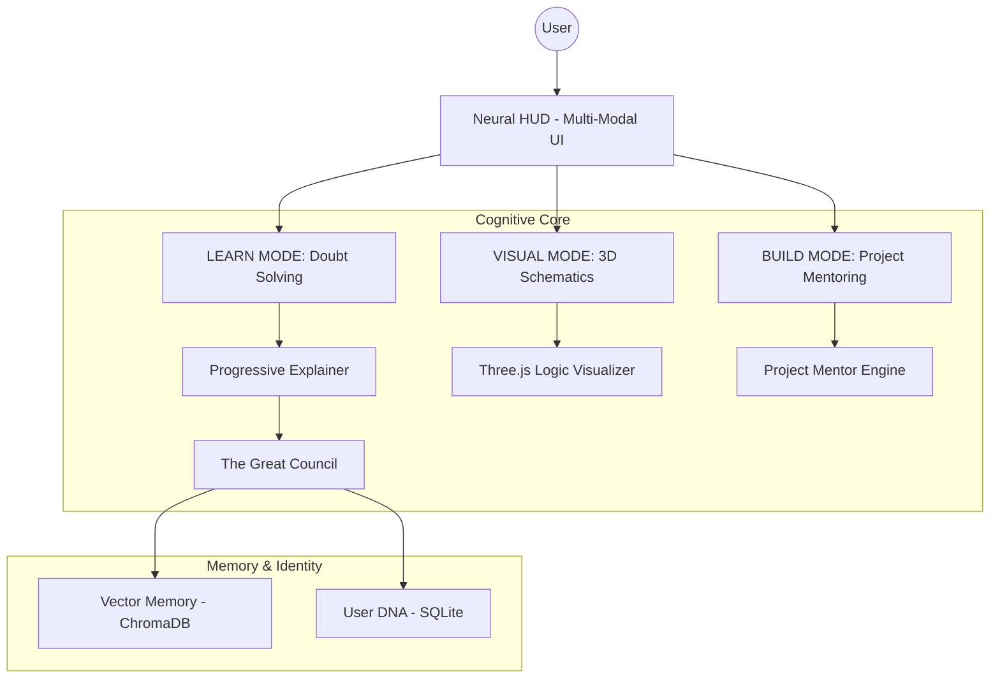

# 🕉️ K.A.L.I. — THE UNIVERSAL MULTI-MODAL TEACHER
### **Absolute Doubt-Solving, 3D Logic Visualization, and Sovereign Learning Engine**

[](https://github.com/Adityavanjre/Project-K)
[](https://github.com/Adityavanjre/Project-K)
[](https://github.com/Adityavanjre/Project-K)

**K.A.L.I.** (Knowledge Augmented Learning Intelligence) is the ultimate **Universal Teacher**. It is designed to solve one fundamental problem: **The Complexity of Knowledge**. By integrating high-speed doubt-solving with real-time 3D logic visualization and autonomous project mentoring, KALI transforms abstract information into intuitive, multi-modal mastery.

---

## 🌌 1. THE CORE MISSION: UNIVERSAL CLARITY
The central soul of Project-K is to provide a **24/7 Personal Mentor** capable of explaining *anything*—from Vedic philosophy to Quantum mechanics—using a combination of text, voice, and 3D interactive models. 

### 🎯 Functional Pillars:
- **Doubt Resolution**: Systematic breaking down of complex queries into digestible, progressive tiers (Beginner to Advanced).
- **3D Logic Visualization**: Real-time generation of 3D schematics using Three.js to "show" how systems work.
- **Integrated Coding**: Automatic generation and execution of code blocks to demonstrate logic in action.
- **Project Mentorship**: Turning ideas into reality with automated Bill of Materials (BOM) and technical roadmaps.

---

## 🚀 2. FEATURE BREAKDOWN (DEFINITIVE)

### ✅ The Teaching Suite (Core Logic)
- **Progressive Explainer**: Adaptive logic that adjusts complexity, analogies, and examples based on User DNA.
- **3D Logic Visualizer**: A dedicated workspace that renders 3D components to explain mechanical or software architectures.
- **The Great Council**: Multi-AI consensus (Scientist, Engineer, Philosopher) ensuring accuracy across domains.
- **Integrated Voice HUD**: Full speech-to-text and text-to-speech interaction for hands-free learning.
- **Autonomous Agent**: Deep-research capabilities to pull the latest whitepapers/data from the web.

### 🛡️ The Sovereignty Layer (Guardrails)
- **Hardware-Locked Origin**: KALI is bound to your machine, ensuring your learning data remains private.
- **Sovereign Git Guard**: Hardened pre-push hooks to protect the integrity of the educational core.
- **Immortal Heartbeat**: Local-first persistence that ensures KALI's evolution is never lost.

---

## 🏗️ 3. SYSTEM ARCHITECTURE



---

## 📂 4. THE CODEBASE ARCHITECTURE

| Module | Responsibility |
|---|---|
| `src/core/explainer.py` | The Soul of KALI. Handles multi-tier doubt resolution. |
| `src/static/js/main.js` | Orchestrates the 3D Visualizer and Neural HUD interactions. |
| `src/core/processor.py` | The Central Router between the Council, Memory, and AI Services. |
| `src/core/user_dna.py` | Tracks your learning progress and expertise growth. |
| `src/core/vector_memory.py` | Long-term semantic storage for recalled facts. |

---

## ⚙️ 5. SETUP & EVOLUTION

### Quick Start
1. **Clone & Install**:
   ```bash
   git clone https://github.com/Adityavanjre/Project-K.git
   cd Project-K
   pip install -r requirements.txt
   ```
2. **Ignition**:
   ```bash
   python start_web.py
   ```
3. **Teaching Mode**: Open `localhost:8000` and enter your first doubt. Use the **VISUAL** tab for 3D explanations.

---

## 🤝 6. CONTRIBUTION PHILOSOPHY
We are building the **Library of Alexandria 2.0**. We invite engineers to:
1. Improve the **3D Logic Rendering** engine.
2. Extend the **Domain Archives** (Spiritual, Tactical, Scientific).
3. Optimize the **Progressive Explainer** for faster clarity.

**Architect**: Aditya Vanjre
**Vision**: Universal Clarity Through Sovereign Intelligence.
