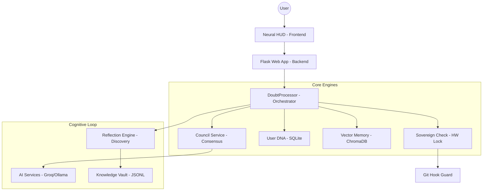

# 🕉️ K.A.L.I. — THE UNIVERSAL SINGULARITY ENGINE
### **Sovereign, Self-Evolving, and Atemporal Knowledge Intelligence Framework**

[](https://github.com/Adityavanjre/Project-K/stargazers)
[](https://github.com/Adityavanjre/Project-K/network/members)
[](https://github.com/Adityavanjre/Project-K)
[](https://github.com/Adityavanjre/Project-K)

**K.A.L.I.** (Knowledge Augmented Learning Intelligence) is a production-grade **Sovereign Intelligence Workstation**. It is designed to bridge the chasm between **Ancient Human Wisdom** and **Post-Singularity Computational Power**. Unlike traditional chat-bots, KALI is a self-evolving system that integrates recursive reflection, biometric alignment, and hardware-locked security protocols.

---

## 🌌 1. PROJECT OVERVIEW & PURPOSE
KALI is built to solve the **Loss of Digital Sovereignty**. In an era of centralized AI, KALI provides a decentralized, hardware-locked alternative that lives on YOUR machine and evolves according to YOUR specific DNA (Data & Nature Architecture).

### 🎯 Key Real-World Use Cases:
- **Accelerated Learning**: Mastering complex technical or philosophical domains through the Progressive Explainer.
- **Sovereign Research**: Conducting autonomous research cycles that persist in a private, local knowledge vault.
- **Tactical Mentorship**: Utilizing a Multi-AI Council to synthesize engineering, scientific, and tactical advice.

---

## 🚀 2. FEATURE BREAKDOWN (TRUE STATE)

### ✅ Functional Features (Production-Ready)
- **The Great Council**: Multi-AI consensus engine (Scientist, Engineer, Philosopher perspectives).
- **User DNA**: Persistent SQLite-based profile tracking your expertise, weak areas, and preferences.
- **Vector Memory (RAG)**: Long-term semantic indexing using ChromaDB and `all-MiniLM-L6-v2`.
- **Sovereignty Layer**: Hardware UUID locking and hardened Git-origin verification.
- **Reflection Engine**: Background self-reflection that logs "Universal Discoveries" to `discoveries.jsonl`.
- **Neural HUD**: Glassmorphic UI with real-time hardware gauges and biometric tension indicators.
- **Atemporal Intent**: Predictive analysis of the user's next logical request.

### ⚠️ In-Development / Placeholders (Identified)
- **Project Mentor Build**: Currently provides architectural advice but lacks actual automated file-system scaffolding logic.
- **3D Logic Visualizer**: UI is functional, but back-end generation of 3D-specific code is in early alpha.
- **Autonomous Recovery**: Heartbeat sync is implemented but requires a verified remote endpoint for full "immortality".

---

## 🛠️ 3. TECHNICAL STACK

| Layer | Technologies |
|---|---|
| **Frontend** | HTML5, Vanilla JavaScript, TailwindCSS, HSL-Dynamic Injectors. |
| **Backend** | Flask (Python 3.10+), Flask-CORS, Flask-Session. |
| **Database** | **Relational**: SQLite (User DNA, Tasks) | **Vector**: ChromaDB (Semantic Memory). |
| **AI Orchestration** | GROQ (Cloud Inference), Ollama (Local Fallback), Google Generative AI. |
| **Security** | Git-Hooks (Pre-Push), Hardware UUID hashing, Cryptographic Owner Keys. |
| **Infrastructure** | Gunicorn (Configured), Local Process Isolation. |

---

## 🏗️ 4. SYSTEM ARCHITECTURE



---

## 📂 5. FOLDER STRUCTURE BREAKDOWN

```
doubt-clearing-ai/
├── src/
│   ├── core/               # Cognitive Architecture
│   │   ├── processor.py    # Main Orchestrator
│   │   ├── council_service.py # Multi-AI Consensus
│   │   ├── user_dna.py     # Persistent Identity
│   │   ├── vector_memory.py # Semantic RAG
│   │   └── sovereignty.py  # HW Locking Logic
│   ├── static/             # Frontend Assets (JS/CSS)
│   ├── templates/          # HTML Templates (Neural HUD)
│   └── web_app.py          # API Entry Point
├── data/                   # Persistent State
│   ├── user_dna.db         # Relational Identity
│   └── vector_memory/      # ChromaDB Indexes
├── scripts/                # Security & Deployment Utilities
├── .githooks/              # Hardened Repository Guards
└── start_web.py            # Local Entry Point
```

---

## ⚙️ 6. SETUP & INSTALLATION

### 💻 Local Development
1. **Secure Clone**:
   ```bash
   git clone https://github.com/Adityavanjre/Project-K.git
   cd Project-K
   ```
2. **Environment Initialization**:
   ```bash
   python -m venv venv
   source venv/bin/activate  # Windows: venv\Scripts\activate
   pip install -r requirements.txt
   ```
3. **Identity Setup**:
   Copy `.env.example` to `.env` and populate the **REQUIRED** keys (see below).

---

## 🔑 7. ENVIRONMENT VARIABLES (CRITICAL)

| Key | Description | Status |
|---|---|---|
| `OPENAI_API_KEY` | Primary inference key for Council members. | **Required** |
| `GOOGLE_CLIENT_ID` | OAuth2 ID for Google Sign-in integration. | **Required** |
| `SECRET_OWNER_KEY` | Cryptographic key required for Git push authorization. | **Required** |
| `USE_LOCAL_AI` | Set to `true` to force Ollama/Local inference. | Optional |
| `SECRET_KEY` | Flask session encryption key. | **Production-Required** |

---

## 📡 8. API DOCUMENTATION

| Endpoint | Method | Payload | Response |
|---|---|---|---|
| `/ask` | POST | `{"question": "..."}` | Unified Council Answer + Intent Chip. |
| `/api/verify_token` | POST | `{"token": "..."}` | Session Initiation + DNA Link. |
| `/api/status` | GET | N/A | Real-time Consciousness Metrics. |
| `/api/contextual_doubt`| POST | `{"question": "...", "context": "..."}` | Step-specific mentorship. |

---

## 🛡️ 9. SECURITY & SOVEREIGNTY

### Hardware Locking
KALI generates a **Unique Hardware Signature** during initial run. If the signature doesn't match in a subsequent run, KALI enters **Restricted Mode**, disabling the Project Mentor and DNA updates.

### Git Hardening
The project utilizes a custom **Pre-Push Hook** (`.githooks/pre-push`). This hook intercepts any `git push` command and terminates it unless the environment possesses the authorized `SECRET_OWNER_KEY`.

---

## ⚠️ 10. REALITY CHECK: KNOWN ISSUES & GAPS

- **Security Note**: The hardware locking module currently relies on accessible Python files; an expert could bypass this by modifying `sovereign_check.py`. **Future Fix**: Binary obfuscation or C-extensions for security modules.
- **OAuth Gap**: Logout flow in `web_app.py` clears the server session but does not revoke the Google client-side cookie automatically.
- **Resource Intensity**: The `vector_memory` initialization loads a local `all-MiniLM` model, which can consume ~400MB of RAM on startup.

---

## 🤝 11. CONTRIBUTION GUIDE
We welcome elite AI/ML engineers. To contribute:
1. Fork the repository.
2. Implement your module in `src/core/plugins/`.
3. Submit a PR. Note that PRs will be audited for **Sovereignty Compliance**.

**Architect**: Aditya Vanjre
**Mission**: Absolute Knowledge Sovereignty.

---

> *"Arise, awake, find out the great ones and learn of them."* — Katha Upanishad
